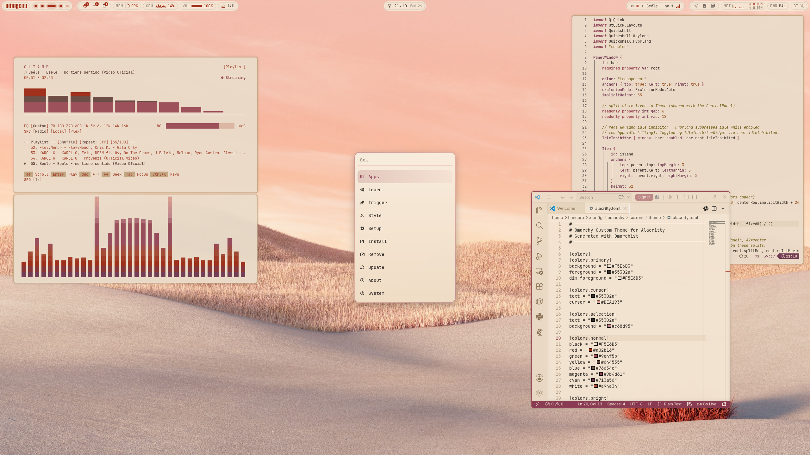

# Rose of Dune

Inspired by the gentle glow of desert dunes at dusk, where rose-gold light meets earthy brown shadows.
White and rose-toned surfaces evoke calm and elegance, while the brown whisper adds depth and grounded warmth.
Designed for those who want a subtle, refined workspace — graceful, inviting and quietly radiant.
Every color is tuned for WCAG-AA legibility, for a calm, elegant workspace in any light.

# Installation Theme

To install this theme, simply use the omarchy-theme-install command:

```bash
omarchy-theme-install https://github.com/HANCORE-linux/omarchy-roseofdune-theme.git
```



#### Quickshell-Bar
[LINK](https://github.com/HANCORE-linux/quickshell-dots)

#### Theme-Hook-Manager
[Link](https://github.com/OldJobobo/theme-hook-plugin-manager)
